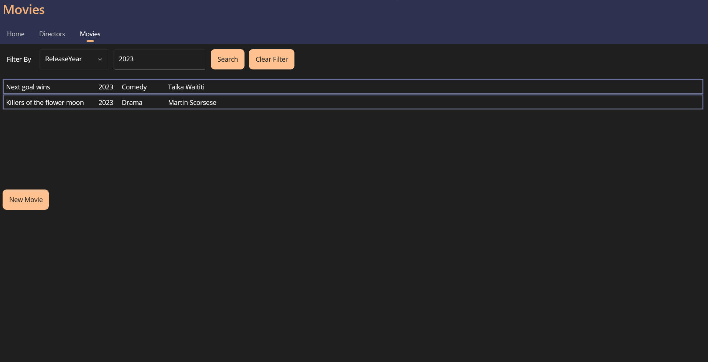

# Movies Catalog
Aplikacja napisana na potrzeby przedmiotu Programowanie Wizualne na VII semestrze kierunku Informatyka, na Politechnice Poznańskiej.

Skład grupy:
- Szymon Pasternak

## Konfiguracja
W rozwiązaniu znajdują się trzy możliwe aplikacje do uruchomienia:
- Aplikacja konsolowa `Pasternak.MoviesCatalog` - wyświetla napis *This is console app*.
- Aplikacja webowa `Pasternak.MoviesCatalog.WebApp` - umożliwia przeglądanie, dodawnaie, edytowanie, usuwanie i filtrowanie reżyserów oraz filmów. Plik App.config odpowiada za wybranie źródła danych. Do wyboru jest `DAOMock1.dll`, `DAOMock2.dll` lub `DAODB.dll`.

- Aplikacja desktopowa `Pasternak.MoviesCatalog.MAUI` - umożliwia przeglądanie, dodawnaie, edytowanie, usuwanie i filtrowanie reżyserów oraz filmów. Plik App.config odpowiada za wybranie źródła danych. Do wyboru jest `DAOMock1.dll`, `DAOMock2.dll` lub `DAODB.dll`.

---
31.01.2024
